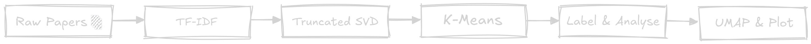
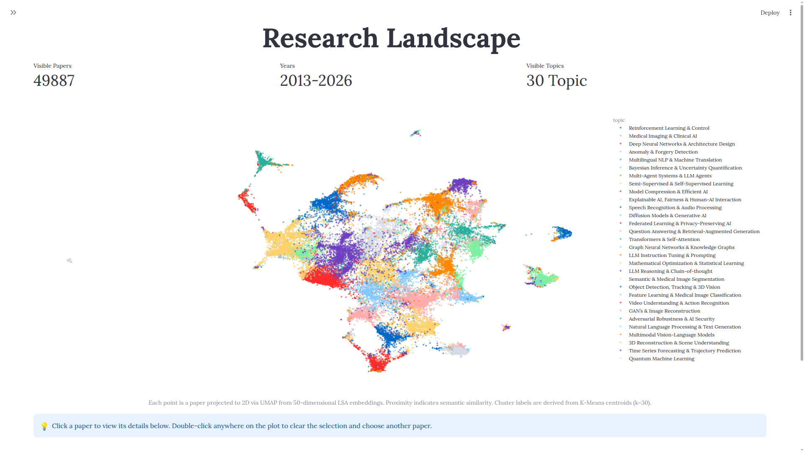
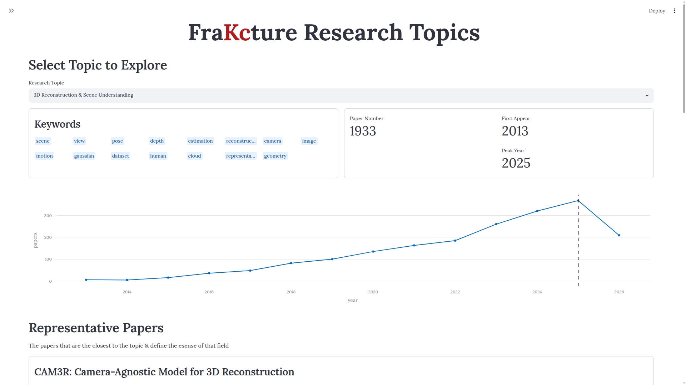

# FraKcture

<p align="center">
    
    </p>

**Inspired by King crimson's Discpline & Fracture song themes of structural collaspe and pure mastery of craft**

**Discovering the semantic landscape of Machine Learning research through unsupervised topic modeling.**

FraKcture is end-to-end NLP project that analyzes thousands of arXiv Machine Learning papers to discover latent research communities and explore how the field evolved from **2013–2026**.

Instead of searching for individual papers, FraKcture provides an interactive view of the research landscape, allowing users to explore topics, representative papers, and publication trends.

> **Version:** 0.1

---

## Demo

> **Live Demo:** _(Coming Soon)_

<!-- Add Streamlit URL here -->

---

## Dataset

**Source**

- Cornell arXiv Dataset (Kaggle)

**Categories**

- cs.LG
- cs.AI
- cs.CL
- cs.CV
- stat.ML

**Time Range**

2013 – 2026

**Statistics** - **version 0.1**

| Metric            |    Value |
| ----------------- | -------: |
| Original Papers   | ~554,000 |
| Papers Analyzed   |   50,000 |
| Time Span         | 14 Years |
| Topics Discovered |       30 |

## Methodology

## 

## Features

- Interactive semantic landscape of 50,000 research papers
- Topic discovery using Latent Semantic Analysis
- UMAP visualization of research communities
- Topic exploration dashboard
- Publication trend analysis
- Representative papers for every topic
- Search and filtering
- Interactive paper inspection
- Direct links to arXiv papers

---

## Dashboard

### Research Landscape

## 

Interactive UMAP projection of the latent semantic space.

Features:

- Topic filtering
- Publication year filtering
- Paper search
- Interactive paper selection

---

### Topic Explorer

## 

Explore each discovered research community.

Displays:

- Topic keywords
- Publication statistics
- Publication trend
- Representative papers

---

## Example Topics

FraKcture discovers topics such as:

- Transformer Architectures & Attention
- Diffusion Models & Generative AI
- Reinforcement Learning & Robotics
- Graph Neural Networks
- Medical Imaging
- Federated Learning
- Question Answering & Retrieval-Augmented Generation
- Multi-Agent Systems
- Explainable AI
- Bayesian Learning

---

## Repository Structure

```text
FraKcture/

├── app/                 # Streamlit application
├── data/                # Processed datasets and artifacts
├── models/              # Saved ML models
├── notebooks/           # Experiments
├── assets/              # Images and diagrams
├── src/                 # Pipeline source code
└── README.md
```

---

## Roadmap

### Version 0.2

- LDA comparison
- BERTopic comparison
- GPU acceleration with RAPIDS/cuML
- Improved research reports
- Enhanced topic comparison
- Integration with VeKctor Engine
- Research like academic paper

---

## Project Motivation

From listening to King crimson's fracture song and was working on a search engine idea for Arxiv research paper the idea of fraKctured got to me as a way to analyse and research and study trends of AI research and trends, also NLP is fun and wanted to try classical NLP techniques and compare them to deep learning methods

## Tasks

- [x] ArXiv API
- [x] Kaggle ArXiv dataset filtering(2013-2026)
- [x] Paper Sampler
- [x] Preprocessing + Cleaning
- [x] TF-IDF
- [x] SVD
- [x] K-Means
- [x] Artifacts
- [x] UMAP
- [x] Clustering Analysis
- [x] Inference & Questions
- [x] Streamlit
- [ ] Finish version 0.1v
- [ ] Polish README.md
- [ ] LSA vs LDA results
- [ ] Integrate NVIDIA cuML
- [ ] Deploy Pre-Computed version (With 50K papers)
- [ ] Deploy live model using subset around 1k-5k papers
- [ ] Finish version 0.2v
- [ ] Integrate with VeKctor Engine(Arxiv Hybrid Search engine)
- [ ] BERTopic
